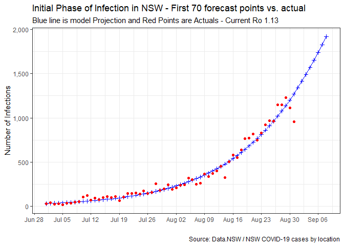
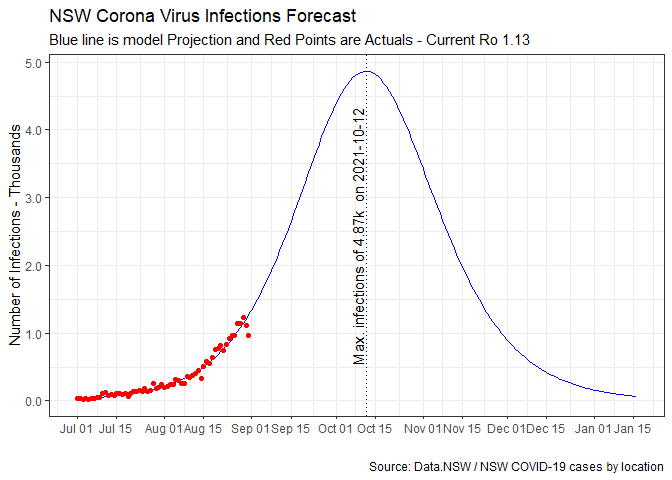

### Type of Model, Assumptions and Data used in projection

__Model used__

-   The forecast model is based on the SIR Model for Spread of Disease and adoped from this blog post <https://blog.ephorie.de/covid-19-the-case-of-germany>     


__Key Assumptions__

* One the key inputs of the model is the `susceptible individuals` in NSW.
* With the current vaccination rates, the model assumes at least 90% vaccination for 16 and older cohort in the next few weeks
* The proportion of 16 and older cohort is assumed at 81.4% and sourced from <http://www.healthstats.nsw.gov.au/Indicator/Dem_pop_age>
* At this point, no breakthrough infections are factored (which is very optimistic). 
* Moreover, the model also optimistically assumes the under 16 cohort are not at risk of infection
* We can build on the sensitivity of `susceptible individuals` later via a shiny interactive module (to follow shortly). 
* The model starts from 01Jul21      


__Data source & things to keep in mind__

-   Data for the analysis is sourced from Data.NSW and we have used the `NSW Covid19 case by location` dataset. This data set differs from the numbers issued by the Premier in her daily presser due to the timing in data collection. NSW Helath reports from 8am to 8pm whilst the dataset used is 00:00 Hrs to 24:00 Hrs.
-   The last data point in the dataset is only fully updated the next day     


### Model output

* Lets first run the code in `code/nsw_forecast.R` to generate the projection 

```
## Warning: package 'readr' was built under R version 4.1.1
```

```
## Warning: JSON string contains (illegal) UTF8 byte-order-mark!
```

* The code will generate two plots, one for the first 70 days to see how well actuals line-up with model and a second one for 200 days to understand infection 
* There is also an additional data set of confirmed cases under the variable `nsw`. I found having this helpful as I use this scan for any potential locations close to where I live.     


#### Lets view the projection for the first 70 days:

```
## Warning: Removed 9 rows containing missing values (geom_point).
```

<!-- -->

* As you can see actuals line-up nicely with the model. It makes one wonder how much of an impact targetted lockdowns have had in stopping th delta variant.      


#### Next lets view the full lifecycle of the current outbreak 

```
## Warning: JSON string contains (illegal) UTF8 byte-order-mark!
```

```
## Warning: Removed 139 rows containing missing values (geom_point).
```

<!-- -->
* The plot shows the potential trajectory of the current wave of infections.
* Clearly, despite our optimistic assumptions the model shows us that there is a potentially frightening few months ahead for NSW.     


#### Implications for NSW
* It appears NSW still has a lot of work to do to get the currrent wave of infections under control. 
* We can also use the projection to manage our own expectations of the future such as:
        * Potentially our kids ae not likely to go back to school this calendar year
        * Supply chain is likely to be interrupted, so plan ahead for provisions and gifts
* Perhaps the most important takeaway from the model is to get vaxed and to practive proper hygine/social distancing as we are not out of the woods as yet!
        
